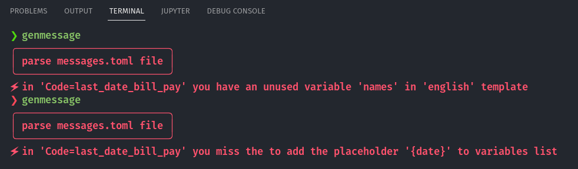
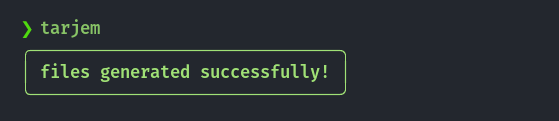
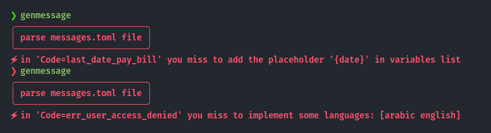
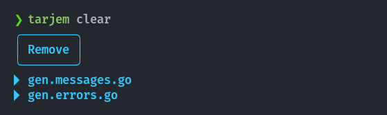

Genmessage is a generator to easy translate your Go application ❤️.

- You only have to fill the `messages.toml` file.
- You can use variables as placeholers in your translation templates.
- Fast! We don't use `text/template` pacakge in the exported go files, We just use `fmt.Sprintf`.
- Clear function arguments, No more ambiguity with maps!
- Out-of-the-box error handling!

## Installation
```bash
go install github.com/zakaria-chahboun/genmessage@latest
```
## Usage
You have to create a `messages.toml` file, example:

````toml
# messages.toml file

# normal 😇
[[Messages]]
Code = "last_date_pay_bill"
Variables = {date="datetime"}
[Messages.Templates]
english = "The last date for paying bills is {date}."
arabic = "آخر أجل لتستديد الفواتير هو {date}"

# error handling 🥲
[[Messages]]
Code = "err_user_access_denied"
Status = "danger" # optional
[Messages.Templates]
english = "Incorrect Username or Password! Try again."
arabic = "إسم المستخدم أو كلمة المرور غير صحيحة! حاول من جديد."

# error handling 🥲
[[Messages]]
Code = "error_stock_limit_exceeded"
Status = "warning" # optional
Variables = {name="string", quantity="int"}
[Messages.Templates]
english = "Stock limit exceeded! Only {quantity} left in stock {name}."
arabic = "تم تجاوز حد المخزون! لم يتبقى سوى {quantity} من مخزون {name}."
````

or just create it by `genmessage init`.



As you see, we split messages in two parts:

| normal message | error handling messages |
|----------------|-------------------------|
| Code = any name you want! | Code name starts with `err` or `error`.  |

## Generate go files
run `genmessage` to export final go files.




In error case, You will have a pretty cool error messages *(thanks to [cute](https://github.com/zakaria-chahboun/cute) package)* 😍:



You will have `gen.messages.go` which contains all *normal* messages. And you will have also `gen.errors.go` which contains all *error handling* messages if exists!

The result will be like that:

### gen.messages.go
```go
package messages

import (
	"fmt"
	"time"
)

type Message struct {
	Code    string
	Message string
}

/* language type */
type Lang string

/* to store locally the currect language used in app */
var currectLang Lang

/* to set the currect language used in app */
func SetCurrectLang(language Lang) {
	currectLang = language
}

/* enum: Message.Code */
const (
	LastDatePayBill = "last_date_pay_bill"
)

/* enum: Templates.{lang} */
const (
	LangArabic  Lang = "arabic"
	LangEnglish Lang = "english"
)

func CreateLastDatePayBill(
	date time.Time,
) (m *Message) {
	m = &Message{}
	m.Code = LastDatePayBill
	switch currectLang {
	case LangArabic:
		m.Message = fmt.Sprintf("آخر أجل لتستديد الفواتير هو %v", date.Format("2006-01-02 15:04:05"))
	case LangEnglish:
		m.Message = fmt.Sprintf("The last date for paying bills is %v.", date.Format("2006-01-02 15:04:05"))
	}
	return
}
```

### gen.errors.go
```go
package messages

import (
	"fmt"
)

type MessageError struct {
	Code    string
	Status  Status // optional
	Message string
}

/* MessageError method */
func (this *MessageError) Error() string {
	return fmt.Sprintf("%v: %v", this.Code, this.Message)
}

/* enum: MessageError.Code */
const (
	ErrUserAccessDenied     = "err_user_access_denied"
	ErrorStockLimitExceeded = "error_stock_limit_exceeded"
)

/* status type */
type Status string

/* enum: MessageError.Status */
const (
	StatusDanger Status = "danger"
	StatusWarning Status = "warning"
)

func CreateErrUserAccessDenied() (m *MessageError) {
	m = &MessageError{}
	m.Code = ErrUserAccessDenied
	m.Status = StatusDanger
	switch currectLang {
	case LangArabic:
		m.Message = fmt.Sprintf("إسم المستخدم أو كلمة المرور غير صحيحة! حاول من جديد.")
	case LangEnglish:
		m.Message = fmt.Sprintf("Incorrect Username or Password! Try again.")
	}
	return
}

func CreateErrorStockLimitExceeded(
	name string,
	quantity int,
) (m *MessageError) {
	m = &MessageError{}
	m.Code = ErrorStockLimitExceeded
	m.Status = StatusWarning
	switch currectLang {
	case LangArabic:
		m.Message = fmt.Sprintf("تم تجاوز حد المخزون! لم يتبقى سوى %d من مخزون %s.", quantity, name)
	case LangEnglish:
		m.Message = fmt.Sprintf("Stock limit exceeded! Only %d left in stock %s.", quantity, name)
	}
	return
}
```

## Fields
* Required fields ✅:
  - Code
  - [Messages.Templates]
* Optional fields 🤷:
  - Status
  - Variables

In *[Messages.Templates]* there is no rule to create the name of languages fields. You can write any field name you want:
```toml
[Messages.Templates]
english = "...."
arabic = "...."

#or 
[Messages.Templates]
en = "...."
ar = "...."

#or
[Messages.Templates]
anglais = "...."
arabe = "...."

#or 👀
[Messages.Templates]
lang1 = "...."
lang2 = "...."
lang3 = "...."
```

⚠️ But the languages fields must be identical in all messages.

## Variables and Types
You can add Variables in your templates, These types are allowed:

`int`, `float`, `string`, `date`, `time`, `datetime`

Of course you can add these variables as placeholders in templates. You can call a variable many times in template 👍🏻:

```toml
[[Messages]]
Code = "test"
Variables = {name="string"}
[Messages.Templates]
en = "My name is {name}, Can you call me {name} 🤠?"
fr = "Je m'appelle {name}, pouvez-vous m'appeler {name} 🤠?"
```

## Use the message for error handling 🔥
All error messages is located in `gen.errors.go` file, You can easily return it like an `error`:

```go
package main

import (
  "fmt"
  "your-module/messages"
)

func main() {
  // choose a language
  messages.SetCurrectLang(messages.LangEnglish)
  
  err := login("@captin_bassam","123456")
  if err != nil {
    panic(err)
  }
}

func login(name, pass string) error {
  // a way of login 👀
  if name == "@captain_majid" && pass == "gooooal"{
	return nil
  }
  return CreateErrUserAccessDenied()
}
```

## Clear
run `genmessage clear` if you want to remove the generated go files:



## Other argments
You will find all other argments in help:
```sh
genmessage help
```

## Contribute 🌻
Feel free to contribute or propose a feature or share your idea with us!

-----
twitter: [@zaki_chahboun](https://twitter.com/Zaki_Chahboun)